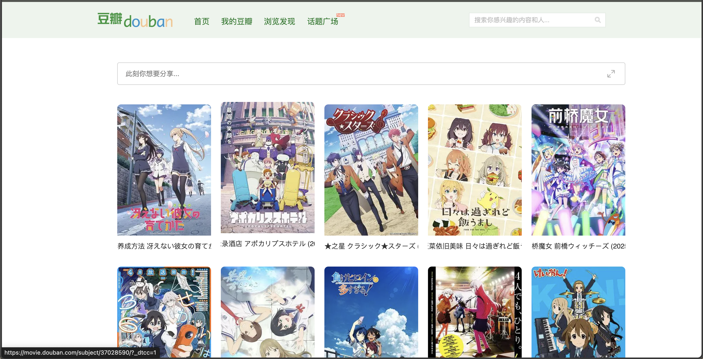

# 豆瓣页面优化

## 豆瓣收藏页面优化

优化脚本：`beautify_collection_page.js`

### 优化内容

针对个人的收藏页面下的影视剧展示方式进行优化

- 移除侧边栏
- 将所有影视剧以5列的卡片形式进行展示
- 自动加载下一页

### 优化网页

- 我想看：https://movie.douban.com/people/*/wish
- 我看过：https://movie.douban.com/people/*/collect
- 我在看：https://movie.douban.com/people/*/do

### 演示

## 豆瓣主页页面优化

优化效果同收藏页

优化脚本：`beautify_home_page.js`

### 优化内容

- 移除侧边栏
- 五栏排列布局
- 没有自动加载下一页（豆瓣主页加载问题，只有一页内容，等官方更正后，再添加)

### 优化网页

- 主页：www.douban.com

### 效果演示

